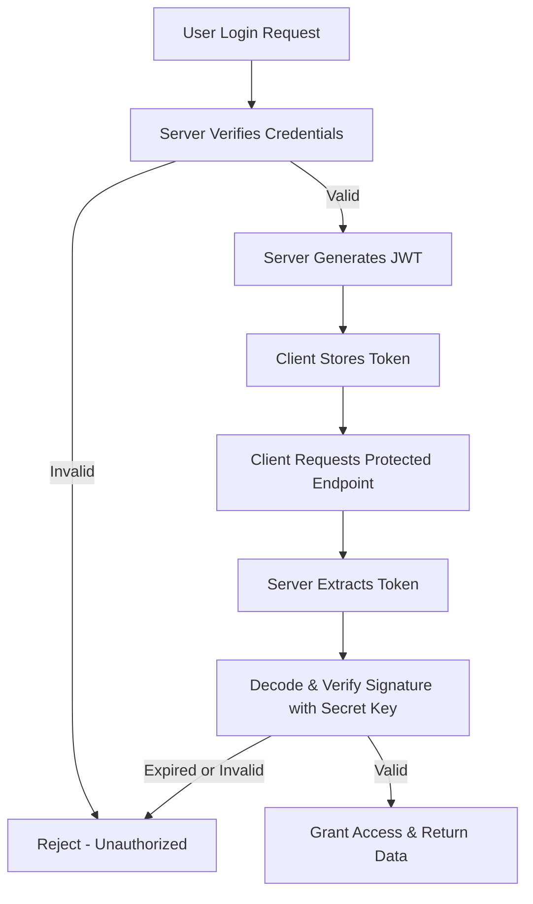

# JWT Authentication: A Complete Guide

This document provides a clear explanation of **JWT (JSON Web Token) authentication**, including how it works, why it’s used, and the control flow with examples. This is designed for future revision and quick clarification.

---

## 🔑 What is JWT?

* **JWT (JSON Web Token)** is a compact, self-contained way to securely transmit information between a client and a server as a JSON object.
* It is commonly used for **stateless authentication** in web APIs.

---

## 📦 Structure of a JWT

A JWT has **three parts** separated by dots:

```
header.payload.signature
```

* **Header**: Contains metadata like algorithm (`alg`) and type (`typ`).
* **Payload**: Contains claims (e.g., `uid`, `email`, `exp`).
* **Signature**: A cryptographic hash of `header + payload`, signed with the server’s secret key.

Example JWT:

```
eyJhbGciOiJIUzI1NiIsInR5cCI6IkpXVCJ9.
  eyJ1aWQiOiIxMjMiLCJlbWFpbCI6ImFiY0BleGFtcGxlLmNvbSIsImV4cCI6MTY5NTAwMDAwMH0.
  sflKxwRJSMeKKF2QT4fwpMeJf36POk6yJV_adQssw5c
```

---

## ⚙️ How JWT Authentication Works

### 1. Login Phase

1. User sends credentials (`email`, `password`) to the server.
2. Server verifies credentials against the database.
3. If valid:

   * Creates a **payload** with user info + expiry time.
   * Signs the payload with the **server’s secret key** to generate the signature.
   * Returns the **JWT** (header.payload.signature) to the client.

### 2. Client Stores Token

* Client stores the JWT (in **HTTP-only cookie**, **localStorage**, or **memory**).
* On every request to a protected endpoint, the JWT is sent in the `Authorization` header:

  ```
  Authorization: Bearer <jwt_token>
  ```

### 3. Accessing Protected Endpoints

1. Server extracts token from request header.
2. Decodes header + payload.
3. Recomputes the signature with the **same secret key**.
4. Compares recomputed signature with token’s signature.
5. If they match **and** token not expired → ✅ valid user.
6. If not → ❌ reject request.

---

## 🔄 Control Flow Diagram



---

## 🛠 Example in FastAPI

```python
from fastapi import Depends, HTTPException, status
from fastapi.security import HTTPBearer, HTTPAuthorizationCredentials
from jose import jwt, JWTError

SECRET_KEY = "your_secret_key"
ALGORITHM = "HS256"

security = HTTPBearer()

# Dependency to verify JWT
def access_token_bearer(credentials: HTTPAuthorizationCredentials = Depends(security)):
    token = credentials.credentials
    try:
        payload = jwt.decode(token, SECRET_KEY, algorithms=[ALGORITHM])
        return payload  # contains uid, email, exp, etc.
    except JWTError:
        raise HTTPException(
            status_code=status.HTTP_401_UNAUTHORIZED,
            detail="Invalid or expired token",
        )

# Example protected endpoint
@app.get("/books/all")
async def get_all_books(user_details=Depends(access_token_bearer)):
    return {"message": f"Hello {user_details['email']}, here are your books."}
```

---

## ✅ Key Takeaways

* JWT is **stateless**: server doesn’t store tokens in DB.
* The **secret key** is only on the server and never inside the token.
* Authentication works by **verifying the signature** of the JWT.
* Refresh tokens can be used for long-term sessions and are often stored securely in cookies or DB.

---

## 📌 Quick Revision Checklist

* [ ] JWT = `header.payload.signature`
* [ ] Secret key is never inside token
* [ ] Server recomputes hash to validate token
* [ ] `exp` claim must be checked
* [ ] Use HTTP-only cookies for safer storage

---
